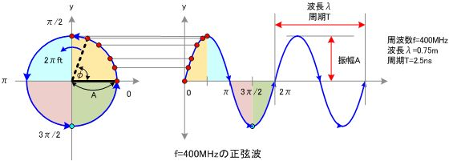

# 理解傅里叶

This content comes from： https://zhuanlan.zhihu.com/p/19763358

## Some definition of $\sin$ and $\cos$
- 正弦波是一个圆周运动在一条直线上的投影。所以频域的基本单元也可以理解为一个始终在旋转的圆。

## 1. 频域
- 任何周期函数，都可以看作是不同振幅，不同相位正弦波的叠加。
- 贯穿时域与频域的方法，就是傅里叶分析。
  
## 2. Fourier Series 的频谱

-  左上中有一个正弦波 $\cos (x)$
-  右上中由两个正弦波叠加 $\cos (x) + A. \cos (3x)$
-  左下由四个正弦波叠加
-  右下由10个正弦波叠加
- 随着正弦波数量逐渐的增长，他们最终会叠加成一个标准的矩形，随着叠加的递增，所有正弦波中上升的部分逐渐让原本缓慢增加的曲线不断变陡，而所有正弦波中下降的部分又抵消了上升到最高处时继续上升的部分使其变为水平线。一个矩形就这么叠加而成了。

- 在这几幅图中，最前面黑色的线就是所有正弦波叠加而成的总和，也就是越来越接近矩形波的那个图形。而后面依不同颜色排列而成的正弦波就是组合为矩形波的各个分量。这些正弦波按照频率从低到高从前向后排列开来，而每一个波的振幅都是不同的。一定有细心的读者发现了，每两个正弦波之间都还有一条直线，那并不是分割线，而是振幅为0的正弦波！也就是说，为了组成特殊的曲线，有些正弦波成分是不需要的。这里，不同频率的正弦波我们成为频率分量。

- 上图就是上面的无数频率叠加图从侧面看过去的样子。 也就是一个矩形波在频域的样子。这就是频谱。

## 3. 傅里叶级数的相位谱
- 一些在时域中看似不可能做到的数学操作， 在频域中很容易。eg. 从某条曲线中去除某些特定的频率成分，这在工程上成为滤波。

- 相位谱：通过时域到频域的变换，我们得到了一个从侧面看的频谱，但是这个频谱并没有包含时域中全部的信息。因为频谱只代表每一个对应的正弦波的振幅是多少，而没有提到相位。在基础的正弦波中： $A\sin(wt+\theta)$ 中，振幅，频率，相位缺一不可，不同的相位决定了波的位置。 

 

- 鉴于正弦波是周期的，我们需要设定一个用来标记正弦波位置的东西。在图中就是那些小红点。小红点是距离频率轴最近的波峰，而这个波峰所处的位置离频率轴有多远呢？为了看的更清楚，我们将红色的点投影到下平面，投影点我们用粉色点来表示。当然，这些粉色的点只标注了波峰距离频率轴的距离，并不是相位。

- 这里需要纠正一个概念：时间差并不是相位差。如果将全部周期看作 $2\pi$ 或者360度的话，相位差则是时间差在一个周期中所占的比例。我们将时间差除周期再乘 $2\pi$，就得到了相位差。
- 在完整的立体图中，我们将投影得到的时间差依次除以所在频率的周期，就得到了最下面的相位谱。所以，频谱是从侧面看，相位谱是从下面看。

- 注意到，相位谱中的相位除了0，就是 $\pi$。因为 $\cos(t+\pi)=-\cos(t)$，所以实际上相位为 $\pi$ 的波只是上下翻转了而已。对于周期方波的傅里叶级数，这样的相位谱已经是很简单的了。另外值得注意的是，由于 $\cos(t+2\pi)=\cos(t)$，所以相位差是周期的，$\pi$,$3\pi$,$5\pi$,$7\pi$ 都是相同的相位。人为定义相位谱的值域为 $(-\pi，\pi]$，所以图中的相位差均为 $\pi$。

## 4. Fourier Transformation
- 傅里叶级数，在时域是一个周期且连续的函数，而在频域是一个非周期离散的函数。其中，周期函数 $f(t)$ 可由三角函数的线性组合来表示，周期函数中周期为T，角频率为w， 频率为f。 
- 傅里叶变化是将一个时域非周期的连续信号，转换为一个在频域非周期的连续信号。而非周期信号可以堪称周期为无穷大的周期信号。 对非周期信号的傅里叶分析方法叫做傅里叶变换。

- 傅里叶变换实际上是对一个周期无限大的函数进行傅里叶变换。

- 原来离散谱的叠加，变成了连续谱的累积。所以在计算上也从求和符号变成了积分符号。

## 5. 欧拉公式

- 根据上图，我们得知 +实数 * i = 虚数 --> +实数 * $i^2$ --> 

# The Discrete Fourier Tansform (DFT)

## Part 1 三角函数的正交性

 - 三角函数系： 集合
    - $$\{0(sin0x), 1(cos0x), sinx, cosx, sin2x, cos2x,..., sin(nx), cos(nx)...\}, n = 0, 1, 2, 3...$$
  - Orthogonality:
    $$\int_{-\pi}^{\pi} \sin nx \cos mx dx = 0, n \neq m$$
    $$\int_{-\pi}^{\pi} \cos nx \cos mx dx = 0, n \neq m$$
    如果两个向量正交，则
   - 如果
